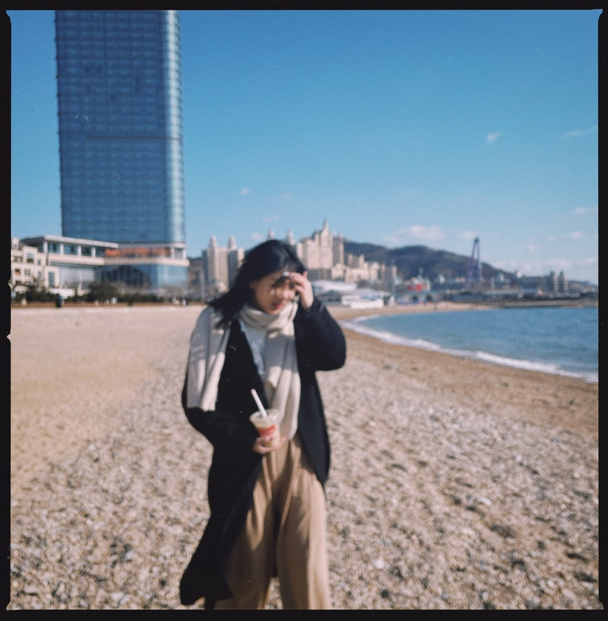

# HTML 개인과제

<small>5557042 경완정</small>

## PrintScreen


## Annotation

1. 사진부분은 \ tag 통해 Local File (Photo)도입했고 PhotoContainer/Photo Class 의 Height은 100%로 설정 즉 Parent Element (Class toper)의 Height로 제한된다(페이지의 35%).
2. Table부분은 td, th의 간격10px로 설정
3. Small Tag의 폰트 칼러은 Gray로 설정 , 기타는 Black
4. BackGround Color은 Black, Toper의 배경은 Color Gradient White 불투명도 100% -> 20%로 변환
5. Class about_me 부분 이탤릭 폰트 사용
6. 학번 id 부분 Small Tag, 폰트 사이즈 5px로 설정
7. Head부분 Local "5557042_Style.css" File 도입
8. Footer 부분 \<a\> Tag 내 포함된 img Tag 사용 Google Logo Link 기입했다 

## SourceCode 

### HTML Code

```html
<!DOCTYPE html>
<html>
    <head>
        <link rel="stylesheet" href="5557042_Style.css">
    </head>
    <body>
        <div class="container">
            <div class="toper">
                <div class="photo_container">
                    
                </div>
                <div class="info">
                    <h1 class="name">경완정<small id="id">5557042</small></h1>
                    <table>
                        <tr>
                            <th>Gender</th>
                            <th>Email</th>
                        </tr>
                        <tr>
                            <td>Women</td>
                            <td>jinqu@kakao.com</td>
                        </tr>
                    </table>
                    <p class="about_me">저는 패션디자인 학과, 외국인 유학생 경완정입니다. 이번 학기 졸업 패션쇼를 준비하고 있는데 관심이 있으면 밑 구글 검색 통해 계명대 검색해 보세요~</p>
                </div>
            </div>
        </div>
        <div class="footer">
            <a href="https://google.com" target="_blank">
                
            </a>
        </div>
        
    </body>
</html>
```

### CSS Code

```css
@import url('https://fonts.googleapis.com/css2?family=Noto+Serif+KR:wght@200..900&display=swap');
@import url('https://fonts.googleapis.com/css2?family=Noto+Sans+KR:wght@100..900&display=swap');

html {
    height: 100%;

}

body {
    background-color: black;
    height: 100%;
    overflow: hidden;
    padding: 0;
    margin: 0;
}

small {
    color: gray;
}

.container {
    height: 100%;
    padding: 5% 0 0 5%;
}

.toper {
    margin: 10px 0 10px 10px;
    padding: 15px;
    height: 33%;
    display: flex;
    background: linear-gradient(90deg, rgba(255,255,255,1) 0%, rgba(255,255,255,0.8) 100%);
    border-radius: 20px 0 0 20px;
}

.footer {
    position: absolute;
    margin: 0 10px 0 0;
    padding: 15px;
    display: flex;
    bottom: 0
}

.about_me {
    font-style: italic;
}


.photo_container {
    height: 100%;
    overflow: hidden;
    padding-left: 6%;
    flex-shrink: 0;
}

.photo {
    height: 100%;
    overflow: hidden;
}

.info {
    padding-left: 20px;
    color: black;
    font-family: "Noto Serif KR", serif;
}

.name {
    font-family: "Noto Sans KR", sans-serif;
    font-style: normal;
}

td, th {
    padding: 10px
}

#id {
    font-size: small;
    padding: 5px;
}

#google {
    height: 20px;
}
```


